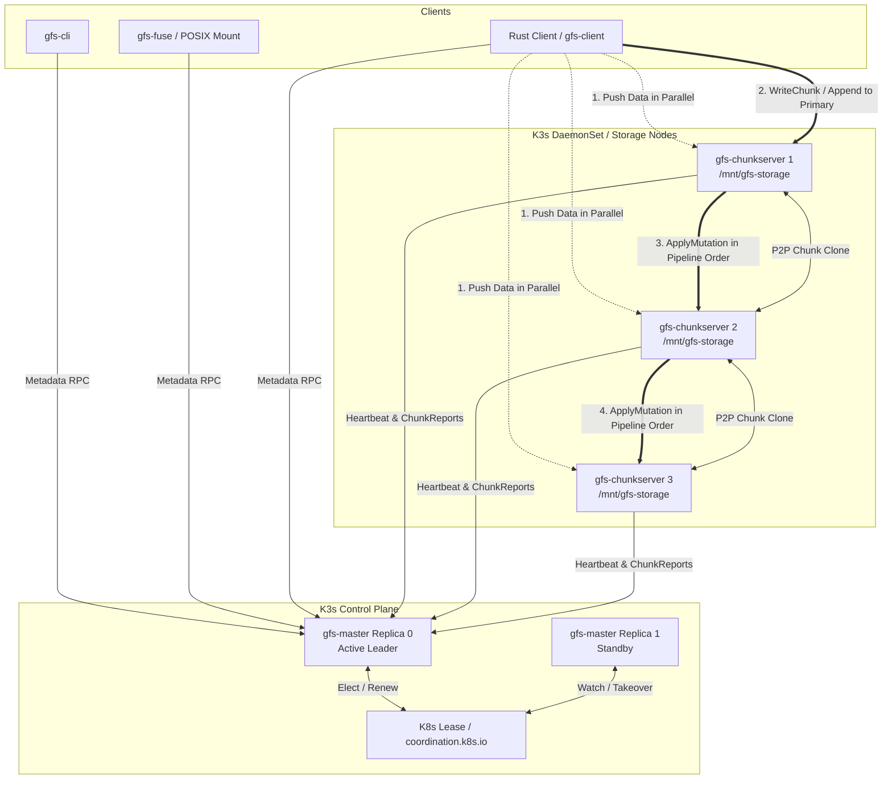

# GFS-RS: Google File System in Rust

Production-grade reimplementation of the Google File System (GFS), written in Rust and architected for bare-metal ARM64 Raspberry Pi clusters orchestrated by K3s.

> 📖 **Hands-On Learning Guide & Roadmap**: See [**`TASKS.md`**](file:///Users/karolszymanowski/projects/dfs/TASKS.md) for the complete educational plan, distributed systems concepts (inodes, bit rot, leases, VFS), and step-by-step implementation tasks.



---

## Workspace Structure

| Crate | Purpose | Key Responsibilities |
|---|---|---|
| [`crates/gfs-proto`](file:///Users/karolszymanowski/projects/dfs/crates/gfs-proto) | RPC Contracts | Protobuf definitions (`common`, `master_chunkserver`, `client_master`, `chunk_data`, `p2p_clone`), typed conversions. |
| [`crates/gfs-master`](file:///Users/karolszymanowski/projects/dfs/crates/gfs-master) | Metadata & Leader Election | In-memory namespace, chunk table, K8s Lease leader election, dead node reaper, replication balancer, oplog recovery. |
| [`crates/gfs-chunkserver`](file:///Users/karolszymanowski/projects/dfs/crates/gfs-chunkserver) | Storage Node Engine | Chunk storage layout (`/mnt/gfs-storage/chunks/<bucket>/<handle>/`), block-granular CRC32 verification, scrubber, P2P cloning. |
| [`crates/gfs-client`](file:///Users/karolszymanowski/projects/dfs/crates/gfs-client) | Client SDK | Offset mapping, chunk location TTL caching, parallel data pushing, pipelined primary/secondary writes, streaming reads. |
| [`crates/gfs-fuse`](file:///Users/karolszymanowski/projects/dfs/crates/gfs-fuse) | POSIX FUSE Daemon | Bridges POSIX filesystem operations into `gfs-client` calls for transparent filesystem access. |
| [`crates/gfs-cli`](file:///Users/karolszymanowski/projects/dfs/crates/gfs-cli) | Admin & User CLI | Commands: `put`, `get`, `ls`, `health`, `rm`. |
| [`tests/chaos`](file:///Users/karolszymanowski/projects/dfs/tests/chaos) | Chaos Suite | End-to-end failure simulations (chunkserver SIGKILL mid-transfer, master failover). |
| [`tests/bench`](file:///Users/karolszymanowski/projects/dfs/tests/bench) | Benchmarking Tool | Throughput & latency benchmarking with tabular and JSON output formats. |

---

## Prerequisites

- **Rust Toolchain**: 1.82+ (2021 edition)
- **Protobuf Compiler**: `protoc`
- **Docker Buildx** and local registry (e.g. `localhost:5000`)
- **Kubernetes / K3s**: A running K3s ARM64 bare-metal cluster or local `kind`/`k3d` test cluster with `kubectl` configured.

---

## Local Development Loop

```bash
# Check formatting
make lint

# Run all workspace unit tests
make test

# Format codebase
make fmt

# Build release binaries
make build
```

---

## Packaging & Kubernetes Deployment

```bash
# Build multi-arch Docker images (ARM64 & AMD64)
make docker-build REGISTRY=localhost:5000 TAG=v0.1.0

# Push images to registry
make docker-push REGISTRY=localhost:5000 TAG=v0.1.0

# Deploy full stack to K3s cluster
make k3s-deploy

# Teardown stack
make k3s-teardown
```

---

## FUSE Mounting

To mount the GFS cluster on a client Linux node:

```bash
# Create mount directory
sudo mkdir -p /mnt/gfs

# Launch the FUSE daemon
gfs-fuse --mount-point /mnt/gfs --master http://gfs-master.default.svc.cluster.local:50051 &

# Verify mount
ls -la /mnt/gfs
echo "Hello GFS" > /mnt/gfs/test.txt
cat /mnt/gfs/test.txt
```

---

## Troubleshooting & Failure Signatures

| Failure Signature | Probable Cause | Resolution |
|---|---|---|
| `Status::Unavailable: connection refused` | Master leader election in progress or Master pod unready | Check `kubectl get pods -l app=gfs-master` and Lease holder in `kubectl get lease gfs-master-lock`. |
| `ChecksumMismatch` | On-disk block corrupted or partial network packet write | Scrubber automatically reports corrupted blocks to Master; Master triggers P2P re-clone from healthy replicas. |
| `Disk isolation check failed` | Chunk storage path is on the root filesystem device | Ensure `/mnt/gfs-storage` is mounted from an isolated block device or dedicated partition. |
| `Lease contention` | Standby master unable to reach API server | Verify RBAC roles in `deploy/k8s/rbac.yaml` and pod anti-affinity. |
