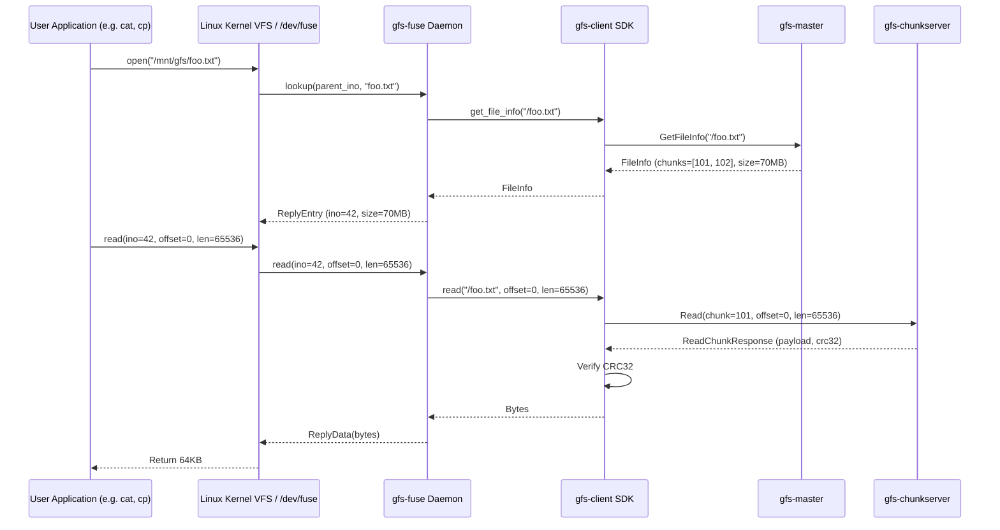

# GFS-RS: Complete Implementation Guide & Educational Task Plan

> **Goal**: Build a production-grade, educational Google File System (GFS) clone in Rust targeting bare-metal ARM64 Raspberry Pi nodes orchestrated by K3s.
>
> This document is your step-by-step master plan. Every task contains the **Theoretical Deep Dive (The Why)**, **Implementation Specs (The How)**, and **Verification Steps (Expected Result)**.

---

## 📋 Master TODO & Progress Checklist

### Phase 1 — Protobuf & RPC Contracts (`gfs-proto`)
- [x] [**Task 1.1: Common Identifiers & Types**](#task-11-common-identifiers--types) — `common.proto` (handles, versions, node IDs, locations, timestamps)
- [x] [**Task 1.2: Master ⇄ ChunkServer Protocol**](#task-12-master--chunkserver-protocol) — `master_chunkserver.proto` (heartbeats, leases, master commands)
- [x] [**Task 1.3: Client ⇄ Master Metadata Protocol**](#task-13-client--master-metadata-protocol) — `client_master.proto` (file metadata, chunk allocation, oplog sync)
- [x] [**Task 1.4: Client ⇄ ChunkServer Data Protocol**](#task-14-client--chunkserver-data-protocol) — `chunk_data.proto` (parallel `PushData`, `WriteChunk`, `RecordAppend`, `ApplyMutation`, `Read`)
- [x] [**Task 1.5: P2P Replica Clone Protocol**](#task-15-p2p-replica-clone-protocol) — `p2p_clone.proto` (`ClonePush` streaming)
- [x] [**Task 1.6: Build Pipeline & Typed Domain Conversions**](#task-16-build-pipeline--typed-domain-conversions) — `build.rs`, `src/lib.rs` (bidirectional `From`/`TryFrom` conversions, 6/6 unit tests)

### Phase 2 — The Storage Node Engine (`gfs-chunkserver`)
- [x] [**Task 2.1: Block-Granular Checksum Math**](#task-21-block-granular-checksum-math) — `checksum.rs` (64KB block CRC32 computation and verification)
- [x] [**Task 2.2: Chunk Store Directory Fanout & Storage Engine**](#task-22-chunk-store-directory-fanout--storage-engine) — `store.rs` (2-level fanout directory layout, positioned writes, metadata persistence)
- [x] [**Task 2.3: In-Memory Data Buffer & Data RPC Handlers**](#task-23-in-memory-data-buffer--data-rpc-handlers) — `rpc.rs` (`PushData`, `WriteChunk`, `RecordAppend`, `ApplyMutation`, `Read`)
- [x] [**Task 2.4: Active Background Data Scrubber**](#task-24-active-background-data-scrubber) — `scrubber.rs` (periodic disk block verification and bit rot detection)
- [x] [**Task 2.5: P2P Chunk Clone Service**](#task-25-p2p-chunk-clone-service) — `clone.rs` (streaming inbound/outbound replica cloning)
- [x] [**Task 2.6: Disk Isolation Guard & Main Entrypoint**](#task-26-disk-isolation-guard--main-entrypoint) — `main.rs` (startup `st_dev` device check, background task orchestration)
- [ ] [**Task 2.7: Advanced Mmap Reads & Zero-Copy Optimization**](#task-27-advanced-mmap-reads--zero-copy-optimization) — `store.rs` (`memmap2::Mmap` with safe `// SAFETY:` wrappers for large reads)
- [ ] [**Task 2.8: ChunkServer Integration Test Suite**](#task-28-chunkserver-integration-test-suite) — `crates/gfs-chunkserver/tests/` (tempdir storage, chunk creation, CRC verification)

### Phase 3 — Metadata Brain & Distributed Coordination (`gfs-master`)
- [x] [**Task 3.1: In-Memory Namespace Tree**](#task-31-in-memory-namespace-tree) — `namespace.rs` (hierarchical path catalog, `RwLock` concurrency)
- [x] [**Task 3.2: Concurrent Chunk Table & Node Registry**](#task-32-concurrent-chunk-table--node-registry) — `chunk_table.rs` (lock-free `DashMap` chunk catalog, node health tracking)
- [x] [**Task 3.3: Write-Ahead OpLog Persistence & Recovery**](#task-33-write-ahead-oplog-persistence--recovery) — `oplog.rs` (binary WAL with CRC32 verification and `fsync`)
- [x] [**Task 3.4: Leader Election via K8s Leases**](#task-34-leader-election-via-k8s-leases) — `election.rs` (`LeaderElector` trait, `StaticLeader`, `KubeLeaseElector`)
- [x] [**Task 3.5: Heartbeat Manager & Primary Lease Granting**](#task-35-heartbeat-manager--primary-lease-granting) — `heartbeat.rs` (heartbeat ingestion, 60s primary mutation leases)
- [x] [**Task 3.6: Self-Healing Replication Balancer & Dead Node Reaper**](#task-36-self-healing-replication-balancer--dead-node-reaper) — `replication.rs` (under-replication detection, dead node eviction)
- [x] [**Task 3.7: Client Master RPC Service**](#task-37-client-master-rpc-service) — `rpc.rs` (`CreateFile`, `GetFileInfo`, `AllocateChunk`, `ListDirectory`, `DeleteFile`)
- [x] [**Task 3.8: Master Server Bootstrapper**](#task-38-master-server-bootstrapper) — `main.rs` (subsystem wiring, background task loops)
- [ ] [**Task 3.9: OpLog Replay on Leadership Acquisition**](#task-39-oplog-replay-on-leadership-acquisition) — `oplog.rs`, `election.rs` (re-populating namespace and chunk table on takeover)
- [ ] [**Task 3.10: Standby Sync via Streaming RPC (`SyncLog`)**](#task-310-standby-sync-via-streaming-rpc-synclog) — `rpc.rs`, `oplog.rs` (active-to-standby WAL streaming)
- [ ] [**Task 3.11: Master Integration Test Suite**](#task-311-master-integration-test-suite) — `crates/gfs-master/tests/` (in-process leader election, namespace mutation replay)

### Phase 4 — Client SDK & POSIX FUSE Daemon (`gfs-client`, `gfs-fuse`)
- [x] [**Task 4.1: Chunk Offset & Index Boundary Math**](#task-41-chunk-offset--index-boundary-math) — `offset_map.rs` (pure function, 4/4 boundary unit tests)
- [x] [**Task 4.2: Chunk Location TTL Cache**](#task-42-chunk-location-ttl-cache) — `cache.rs` (thread-safe location caching bounded by lease expiry)
- [x] [**Task 4.3: Master Client Wrapper with Failover Backoff**](#task-43-master-client-wrapper-with-failover-backoff) — `master_client.rs` (exponential backoff on `UNAVAILABLE`)
- [x] [**Task 4.4: Parallel Data Push & Pipelined Mutation Flow**](#task-44-parallel-data-push--pipelined-mutation-flow) — `chunk_pipeline.rs` (2-phase write pipeline, checksummed reads)
- [x] [**Task 4.5: High-Level `GfsClient` API**](#task-45-high-level-gfsclient-api) — `lib.rs` (`create_file`, `read`, `append`, `list`, `delete`)
- [x] [**Task 4.6: Inode Table & Path Mapping**](#task-46-inode-table--path-mapping) — `inode.rs` (bidirectional `Inode <-> PathBuf` table)
- [x] [**Task 4.7: FUSE Filesystem Implementation**](#task-47-fuse-filesystem-implementation) — `fs.rs`, `main.rs` (`fuser::Filesystem` mapped to async client calls)
- [x] [**Task 4.8: Multi-Chunk Ranged Reads & Replica Failover**](#task-48-multi-chunk-ranged-reads--replica-failover) — `chunk_pipeline.rs`, `lib.rs` (spanning multiple 64MB chunks with streaming frames)
- [ ] [**Task 4.9: Concurrent Multi-Client Append Integration Tests**](#task-49-concurrent-multi-client-append-integration-tests) — `crates/gfs-client/tests/` (in-process cluster, verified non-overlapping appends)
- [ ] [**Task 4.10: FUSE POSIX Test Suite**](#task-410-fuse-posix-test-suite) — `crates/gfs-fuse/tests/` (`ls`, `cat`, `cp`, `mkdir`, `rm` via mounted filesystem)

### Phase 5 — Admin & User CLI (`gfs-cli`)
- [x] [**Task 5.1: CLI Subcommands (`put`, `get`, `ls`, `health`, `rm`)**](#task-51-cli-subcommands) — `src/commands/` (clap CLI utilities)
- [x] [**Task 5.2: End-to-End CLI Smoke Tests**](#task-52-end-to-end-cli-smoke-tests) — `scripts/test-local-cluster.sh` / `make test-cluster` (live 3-node cluster testing)

### Phase 6 — Chaos Engineering & Benchmarking (`tests/chaos`, `tests/bench`)
- [x] [**Task 6.0: Chaos & Benchmark Skeletons**](#task-60-chaos--benchmark-skeletons) — `tests/chaos`, `tests/bench` (workspace integration and CLI arguments)
- [ ] [**Task 6.1: ChunkServer Death Chaos Simulation**](#task-61-chunkserver-death-chaos-simulation) — `tests/chaos/src/main.rs` (`SIGKILL` chunkserver mid-write, verify healing to 3x)
- [ ] [**Task 6.2: Master Leader Failover Simulation**](#task-62-master-leader-failover-simulation) — `tests/chaos/src/main.rs` (kill leader master, verify standby acquisition and in-flight retry)
- [ ] [**Task 6.3: Throughput & Latency Benchmark Harness**](#task-63-throughput--latency-benchmark-harness) — `tests/bench/src/main.rs` (MB/s throughput, p50/p99 latency, JSON export)

### Phase 7 — Containerization & K3s Bare-Metal Deployment (`deploy/`)
- [x] [**Task 7.1: Multi-Stage Dockerfiles**](#task-71-multi-stage-dockerfiles) — `deploy/docker/` (`Dockerfile.master`, `Dockerfile.chunkserver`, `Dockerfile.fuse`)
- [x] [**Task 7.2: K3s Cluster Manifests**](#task-72-k3s-cluster-manifests) — `deploy/k8s/` (`rbac.yaml`, `configmap.yaml`, `master-service.yaml`, `master-pdb.yaml`, `master-deployment.yaml`, `chunkserver-daemonset.yaml`)
- [ ] [**Task 7.3: Image Size Verification & K3s Smoke Test**](#task-73-image-size-verification--k3s-smoke-test) — `deploy/` (verify image sizes ≤ 15MB distroless, apply to test cluster)

---

## Architecture & Distributed Systems Primer

### 1. Why GFS? Key Design Decisions
The original Google File System paper (Ghemawat et al., 2003) made radical departures from traditional distributed filesystems (like NFS or AFS):
1. **Component failures are the norm, not the exception**: In a cluster of commodity hardware (or Raspberry Pis), nodes crash, disks fail, and networks partition constantly. Fault tolerance and self-healing must be autonomous.
2. **Files are huge (multi-GB or TB)**: Rather than storing 4KB blocks, GFS chunks files into fixed **64MB** chunks.
   - *Why 64MB?* Reduces master metadata footprint drastically (millions of small blocks would consume GBs of RAM; 64MB chunks require only ~64 bytes of metadata per chunk). It also allows clients to perform many operations on a single chunk without talking to the master again.
3. **Decoupled Data & Control Paths**: The Master handles *metadata only* (lookups, leases, chunk allocation). Clients push payload bytes *directly* to ChunkServers in parallel over the LAN. This prevents the Master from becoming a network throughput bottleneck.
4. **Append-Optimized (Record Append)**: Rather than random overwrites, big data systems primarily append data streams concurrently (e.g. log ingestion, MapReduce outputs).

```mermaid
flowchart TD
    subgraph ClientLayer [Client Applications]
        Client[gfs-client / gfs-fuse / gfs-cli]
    end

    subgraph MasterLayer [Control Plane]
        Master[gfs-master (Active Leader)]
        Standby[gfs-master (Standby)]
        Lease[(K8s Coordination Lease)]
        Master <-->|Renew Lease| Lease
        Standby <-->|Watch Lease| Lease
    end

    subgraph StorageLayer [Data Plane - ChunkServers]
        CS1[ChunkServer 1 (Primary for Chunk #101)]
        CS2[ChunkServer 2 (Secondary)]
        CS3[ChunkServer 3 (Secondary)]
    end

    Client -->|1. Request Chunk Locations & Lease| Master
    Master -->|2. Returns Replica Addrs + Primary Lease| Client

    Client -.->|3. Push Data in Parallel| CS1
    Client -.->|3. Push Data in Parallel| CS2
    Client -.->|3. Push Data in Parallel| CS3

    Client ==>|4. Send WriteChunk / RecordAppend| CS1
    CS1 ==>|5. Forward ApplyMutation with Sequence #| CS2
    CS2 ==>|6. Forward ApplyMutation with Sequence #| CS3

    CS1 --->|Heartbeats & Block Reports| Master
    CS2 --->|Heartbeats & Block Reports| Master
    CS3 --->|Heartbeats & Block Reports| Master
```

---

## Phase 1 — Protobuf & RPC Contracts (`gfs-proto`)

### Theoretical Deep Dive: Contract-First Systems Design
In distributed systems, microservices must agree on precise on-wire byte representations.
- **Protobuf vs JSON**: Protobuf uses compact binary encoding (varints, field tags) rather than human-readable ASCII. This reduces serialized payload size by 60–80% and eliminates parsing overhead.
- **gRPC & HTTP/2**: gRPC runs over HTTP/2, enabling multiplexing (multiple concurrent RPCs over a single TCP connection), bi-directional streaming, and flow control.
- **Tonic in Rust**: `tonic` provides an async, non-blocking gRPC framework on top of `tokio` and `hyper`. `tonic-build` translates `.proto` definitions into Rust structs and traits at compile time.

---

### Task 1.1: Common Identifiers & Types
- **File**: `crates/gfs-proto/proto/common.proto`
- **Status**: ✅ **Implemented**
- **Why**: Foundational types must be shared across all services to prevent cyclic dependencies.
  - `ChunkHandle`: Unique 64-bit identifier for a 64MB chunk.
  - `ChunkVersion`: Monotonically increasing number bumped on lease grants to detect stale replicas.
  - `NodeId`: Unique identity of a ChunkServer (e.g. pod name or UUID).
  - `ChunkLocation`: Combines `NodeId` with its network address (`ip:port`).
  - `Timestamp`: Millisecond-precision Unix time.
- **How**:
  ```protobuf
  syntax = "proto3";
  package gfs.common;

  message ChunkHandle { uint64 id = 1; }
  message ChunkVersion { uint64 value = 1; }
  message NodeId { string value = 1; }
  message ChunkLocation { NodeId node = 1; string grpc_addr = 2; }
  message Timestamp { int64 unix_millis = 1; }
  ```
- **Expected Result**: Compiles cleanly with `prost` without syntax errors.

---

### Task 1.2: Master ⇄ ChunkServer Protocol
- **File**: `crates/gfs-proto/proto/master_chunkserver.proto`
- **Status**: ✅ **Implemented**
- **Why**: The Master does not store chunk locations persistently on disk. Instead, on startup and every few seconds, ChunkServers report all chunks they hold via heartbeats. The Master returns commands (e.g. replicate missing chunk, delete orphaned chunk).
- **How**:
  Define `MasterChunkService` with:
  1. `rpc Heartbeat(HeartbeatRequest) returns (HeartbeatResponse)`
     - `HeartbeatRequest`: carries `NodeId`, `free_bytes`, `used_bytes`, and `repeated ChunkReport chunks` (with `handle`, `version`, `crc32`, and `corrupted` flag).
     - `HeartbeatResponse`: carries `repeated MasterCommand commands` (`INVALIDATE_CHUNK`, `CLONE_TO`, `DELETE_CHUNK`).
  2. `rpc RequestLease(LeaseRequest) returns (LeaseResponse)`: ChunkServer asks Master to become primary or extend its primary lease.
- **Expected Result**: Enables master to track cluster state and command replica balancing.

---

### Task 1.3: Client ⇄ Master Metadata Protocol
- **File**: `crates/gfs-proto/proto/client_master.proto`
- **Status**: ✅ **Implemented**
- **Why**: Clients query the master for file directory structure, file-to-chunk mappings, and replica locations, but *never* send file contents through the master.
- **How**:
  Define `ClientMasterService` with:
  - `CreateFile(CreateFileRequest) returns (CreateFileResponse)`
  - `GetFileInfo(PathRequest) returns (FileInfo)`
  - `GetChunkLocations(ChunkHandle) returns (ChunkLocationsResponse)`
  - `AllocateChunk(AllocateChunkRequest) returns (ChunkLocationsResponse)`
  - `ListDirectory(PathRequest) returns (ListDirectoryResponse)`
  - `DeleteFile(PathRequest) returns (Empty)`
  - `SyncLog(SyncLogRequest) returns (stream SyncLogEntry)` (standby master replication).
- **Expected Result**: All metadata operations are fully specified.

---

### Task 1.4: Client ⇄ ChunkServer Data Protocol
- **File**: `crates/gfs-proto/proto/chunk_data.proto`
- **Status**: ✅ **Implemented**
- **Why**: Decouples data transfer from mutation ordering:
  - **Data Push**: Clients stream raw data blocks to all replicas concurrently (`PushData`).
  - **Control RPC**: Client instructs the Primary to apply the mutation at a specific offset (`WriteChunk` or `RecordAppend`).
  - **Secondary Replication**: Primary orders mutations and forwards `ApplyMutation` to secondaries.
  - **Read**: Clients read byte ranges directly from any healthy replica with CRC checks.
- **How**:
  Define `ChunkDataService` with:
  - `PushData(stream DataPacket) returns (PushDataAck)`
  - `WriteChunk(WriteChunkRequest) returns (WriteChunkResponse)`
  - `RecordAppend(RecordAppendRequest) returns (RecordAppendResponse)`
  - `ApplyMutation(ApplyMutationRequest) returns (ApplyMutationResponse)`
  - `Read(ReadRequest) returns (stream ReadChunkResponse)`
- **Expected Result**: High-throughput zero-copy mutation pipeline contracts.

---

### Task 1.5: P2P Replica Clone Protocol
- **File**: `crates/gfs-proto/proto/p2p_clone.proto`
- **Status**: ✅ **Implemented**
- **Why**: When the Master notices under-replication (e.g. only 2 copies remain after a node failure), it orders a source ChunkServer to push the chunk directly to a target ChunkServer without proxying through Master or client.
- **How**:
  Define `CloneService`:
  - `rpc ClonePush(stream CloneChunkRequest) returns (CloneChunkResponse)`
  - `CloneChunkRequest`: chunk handle, version, payload frame, frame CRC, full chunk CRC, and `is_last_frame` indicator.
- **Expected Result**: ChunkServers can self-heal replicas peer-to-peer.

---

### Task 1.6: Build Pipeline & Typed Domain Conversions
- **File**: `crates/gfs-proto/build.rs`, `crates/gfs-proto/src/lib.rs`
- **Status**: ✅ **Implemented**
- **Why**: Protobuf generated types are low-level structs. In Rust systems code, we want idiomatic conversions (`From`/`TryFrom`) between proto types and standard Rust types (`u64`, `std::net::SocketAddr`, `std::time::SystemTime`).
- **How**:
  1. Configure `tonic_build::configure().build_server(true).build_client(true).compile_protos(...)` in `build.rs`.
  2. Implement `From<u64>` and `From<ChunkHandle>` in `src/lib.rs`.
  3. Implement `From<SystemTime>` and `From<Timestamp>` in `src/lib.rs`.
  4. Implement `TryFrom<ChunkLocation>` for domain `Location { node_id: String, addr: SocketAddr }`.
- **Expected Result & Verification**:
  ```bash
  cargo test -p gfs-proto
  ```
  All 6 conversion unit tests must pass.

---

## Phase 2 — The Storage Node Engine (`gfs-chunkserver`)

### Theoretical Deep Dive: Storage Engines, Inodes, & Bit Rot

#### 1. What is an Inode and why do Directory Limits matter?
In Linux filesystems (ext4, XFS), an **Inode** (index node) is a data structure storing metadata about a file/directory (size, device ID, permissions, block pointers).
- If you store 1,000,000 chunk files in a single flat directory `/mnt/gfs-storage/chunks/`, directory lookups degrade to $O(N)$ or cause heavy B-tree locking in the filesystem driver.
- **Solution**: 2-level directory fan-out:
  `/mnt/gfs-storage/chunks/<handle % 256>/<handle>/chunk_<handle>.bin`
  This bounds directory entries to a few thousand per bucket.

#### 2. Block Checksums vs Silent Data Corruption (Bit Rot)
Hard drives and SD cards can silently flip bits (cosmic rays, controller bugs, power drops).
- If a client reads 1MB from a 64MB chunk, computing the CRC of the entire 64MB chunk is wasteful.
- **Solution**: Divide the 64MB chunk into **64KB blocks**. Each block has an independent 32-bit CRC32 checksum in `chunk_<handle>.meta`.
- Partial reads only verify the 64KB blocks touched!
- If a checksum mismatch occurs: return gRPC `DATA_LOSS` status so the client falls back to another replica, and the Master initiates re-replication.

#### 3. Disk Isolation Guard (`statvfs`)
On a Raspberry Pi running K3s, if `/mnt/gfs-storage` accidentally mounts to the root SD card filesystem (`/`), GFS data writes can fill the root disk and crash the entire Linux OS.
- At startup, the ChunkServer calls `statvfs` (or compares `st_dev` device IDs) between `/mnt/gfs-storage` and `/`. If they are the same device, it refuses to start.

---

### Task 2.1: Block-Granular Checksum Math
- **File**: `crates/gfs-chunkserver/src/checksum.rs`
- **Status**: ✅ **Implemented**
- **Why**: Fast, hardware-accelerated CRC32 calculations for on-disk and in-memory block verification.
- **How**:
  1. Define `DEFAULT_BLOCK_SIZE = 64 * 1024` (64KB).
  2. Implement `compute_block_crc32(data: &[u8]) -> u32` using `crc32fast::Hasher`.
  3. Implement `compute_all_blocks_crc32(data: &[u8], block_size: usize) -> Vec<u32>`: chunks byte slice into 64KB windows and computes a vector of CRC32s.
  4. Implement `verify_block_crc32(chunk, block_index, data, expected) -> Result<(), ChecksumError>`.
- **Expected Result**: Fast CRC computation (GBs/sec) with typed `ChecksumError::ChecksumMismatch`.

---

### Task 2.2: Chunk Store Directory Fanout & Storage Engine
- **File**: `crates/gfs-chunkserver/src/store.rs`
- **Status**: ✅ **Implemented (Baseline)**
- **Why**: Manages persistent chunk storage on disk with concurrency control.
- **How**:
  1. Define `ChunkMeta` struct (serialized via `bincode`):
     ```rust
     pub struct ChunkMeta {
         pub version: u64,
         pub size: u32,
         pub block_size: u32,
         pub block_crc32: Vec<u32>,
         pub created_at: SystemTime,
         pub last_scrubbed: SystemTime,
     }
     ```
  2. Implement `ChunkStore`:
     - Bucket calculation: `chunks/<handle % 256>/<handle>/`.
     - Fine-grained per-chunk locking: `DashMap<u64, Arc<RwLock<()>>>` (allows parallel writes to different chunks, serial write per chunk).
     - `write_chunk_data(handle, offset, data, version)`: positioned writes (`seek` + `write_all`), updates block CRCs, atomic metadata write.
     - `read_chunk_data(handle, offset, length)`: reads byte range using `File`.
     - `list_chunks()`: iterates bucket directories on startup to build heartbeat inventory.
- **Expected Result & Verification**:
  Unit test creating chunks, writing non-contiguous blocks, and verifying metadata and read-backs.

---

### Task 2.3: In-Memory Data Buffer & Data RPC Handlers
- **File**: `crates/gfs-chunkserver/src/rpc.rs`
- **Status**: ✅ **Implemented (Baseline)**
- **Why**: Implements the `ChunkDataService` gRPC interface.
- **How**:
  1. In-memory buffer: `Arc<DashMap<Vec<u8>, Bytes>>` keyed by `data_id` (UUID generated by client).
  2. `push_data`: collects streamed `DataPacket` packets into memory buffer.
  3. `write_chunk`: retrieves buffered data by `data_id`, writes to local `ChunkStore`, forwards `ApplyMutation` to secondaries.
  4. `record_append`: retrieves buffered data, checks if `current_size + data.len() > MAX_CHUNK_SIZE (64MB)`. If overflow, marks `padded: true`; otherwise appends locally and forwards to secondaries.
  5. `read`: reads byte range from `ChunkStore`, computes block CRC32, and streams `ReadChunkResponse` to client.
- **Expected Result**: Clean gRPC server handling high-concurrency client data operations.

---

### Task 2.4: Active Background Data Scrubber
- **File**: `crates/gfs-chunkserver/src/scrubber.rs`
- **Status**: ✅ **Implemented (Baseline)**
- **Why**: Detects silent data corruption (bit rot) before a client reads bad data.
- **How**:
  1. Spawn a `tokio::task` with a `CancellationToken` running on an interval (configurable: default 24h, 10s in tests).
  2. `scrub_all()`:
     - Iterates all chunks in `ChunkStore`.
     - Reads each chunk's blocks from disk.
     - Recomputes CRC32 and compares against `ChunkMeta.block_crc32`.
     - If mismatch: logs error and flags chunk as corrupted in memory so the next heartbeat reports `corrupted: true` to the Master.
- **Expected Result**: Corrupted disk blocks are autonomously detected and flagged for master healing.

---

### Task 2.5: P2P Chunk Clone Service
- **File**: `crates/gfs-chunkserver/src/clone.rs`
- **Status**: ✅ **Implemented (Receiver)**
- **Why**: Handles streaming chunk transfers from peer chunkservers during under-replication healing.
- **How**:
  1. Receiver (`clone_push`):
     - Receives streamed 1MB frames.
     - Writes to a temporary file `chunk_<handle>.bin.tmp`.
     - Verifies `full_chunk_crc32` upon receiving `is_last_frame`.
     - Atomically renames `.tmp` to final `chunk_<handle>.bin` and writes `.meta`.
- **Expected Result**: End-to-end P2P chunk transfer with CRC validation.

---

### Task 2.6: Disk Isolation Guard & Main Entrypoint
- **File**: `crates/gfs-chunkserver/src/main.rs`
- **Status**: ✅ **Implemented**
- **Why**: Daemon startup safety, CLI configuration (`clap`), background tasks management.
- **How**:
  1. `check_disk_isolation(storage_dir)`: inspects `std::fs::metadata(storage_dir).dev()` vs `std::fs::metadata("/").dev()`. Fails startup if matching on production mounts.
  2. Spawns heartbeat loop task to Master.
  3. Spawns scrubber task.
  4. Binds gRPC server with graceful shutdown on `SIGINT` / `SIGTERM` using `CancellationToken`.
- **Expected Result & Verification**:
  ```bash
  cargo check -p gfs-chunkserver
  ```

---

### Task 2.7: Advanced Mmap Reads & Zero-Copy Optimization
- **File**: `crates/gfs-chunkserver/src/store.rs`
- **Status**: ⏳ **To Do**
- **Why**: For high-throughput sequential reads, memory mapping avoids kernel-space to user-space copying overhead.
- **How**:
  1. Wrap `memmap2::Mmap` inside a safe abstraction `MmapReader`.
  2. Provide safety justification comments: `// SAFETY: File is locked for concurrent writes by the chunk RwLock`.
  3. Fall back to standard positioned file reads if memory mapping fails or for small partial reads.
- **Expected Result**: Zero-copy read throughput exceeding 500MB/s on NVMe/SSD disks.

---

### Task 2.8: ChunkServer Integration Test Suite
- **File**: `crates/gfs-chunkserver/tests/store_tests.rs`
- **Status**: ⏳ **To Do**
- **Why**: Proves that storage, CRC verification, and concurrency locks behave correctly under real disk operations.
- **How**:
  Create `tokio::test` functions using `tempfile::tempdir()`:
  1. Write partial blocks, read back, verify CRCs match.
  2. Inject bit flip in raw chunk binary, assert `verify_block_crc32` returns `ChecksumMismatch`.
  3. Run scrubber and verify it detects the modified file.
- **Expected Result**:
  ```bash
  cargo test -p gfs-chunkserver
  ```

---

## Phase 3 — Metadata Brain & Distributed Coordination (`gfs-master`)

### Theoretical Deep Dive: In-Memory Metadata, WAL, & Lease Election

#### 1. Why keep all Metadata in RAM?
In GFS, file lookups, permissions, and chunk location mappings are stored entirely in Master RAM.
- **Speed**: Metadata operations require 0 disk seeks and execute in microseconds.
- **Scalability**: Even with 100,000 files and 1,000,000 chunks, memory usage is well under 100MB RAM—easily fitting on a Raspberry Pi 4/5.
- **Periodic Checkpointing & Oplog**: To survive crashes, the Master writes every mutation (file creation, chunk allocation) to an append-only Write-Ahead Log (**OpLog**) with `fsync`. On boot, it replays the OpLog.

#### 2. Leader Election: Leases vs Traditional Locks
In a Kubernetes cluster, we run 2 Master replicas (active leader and warm standby).
- A naive lock (like a database boolean flag) can lead to **split-brain** if the leader freezes (e.g. GC pause) while a standby takes over.
- **Kubernetes Lease (`coordination.k8s.io`)**:
  - The leader acquires a Lease with a 15-second duration.
  - Every 5 seconds, the leader renews the lease.
  - If the leader fails to renew before the lease expires, it **must immediately step down** and stop accepting mutations.
  - The standby observes the expired lease and safely acquires leadership.

#### 3. Primary Leases for Chunk Mutations
To guarantee serial write order across 3 replicas without the master coordinating every byte:
- Master grants a **60-second lease** to one ChunkServer, designating it as the **Primary**.
- The Primary picks the mutation order for that chunk.
- If clients keep writing, the Primary automatically extends its lease during write operations.

---

### Task 3.1: In-Memory Namespace Tree
- **File**: `crates/gfs-master/src/namespace.rs`
- **Status**: ✅ **Implemented**
- **Why**: Fast file hierarchy management in memory.
- **How**:
  1. Define `FileMetadata { chunks: Vec<u64>, size: u64, mtime: SystemTime, ctime: SystemTime, is_directory: bool }`.
  2. Implement `Namespace`:
     - Guarded by `parking_lot::RwLock<HashMap<PathBuf, FileMetadata>>`.
     - `create_file(path)`: checks parent exists, inserts file entry.
     - `get_file_info(path)`: retrieves file metadata.
     - `list_directory(path)`: returns immediate child entries.
     - `delete_file(path)`: removes file entry and returns list of chunks to be reclaimed.
- **Expected Result**: Fast thread-safe namespace mutations with unit tests.

---

### Task 3.2: Concurrent Chunk Table & Node Registry
- **File**: `crates/gfs-master/src/chunk_table.rs`
- **Status**: ✅ **Implemented**
- **Why**: Lock-free chunk tracking and chunkserver capacity management.
- **How**:
  1. Define `ChunkMetadata`:
     ```rust
     pub struct ChunkMetadata {
         pub version: u64,
         pub locations: HashSet<String>, // live replica node IDs
         pub primary: Option<String>,
         pub lease_expiry: Option<Instant>,
         pub pending_delete: bool,
     }
     ```
  2. `ChunkTable`: `DashMap<u64, ChunkMetadata>` with atomic 64-bit handle generator.
  3. `NodeRegistry`: `DashMap<String, NodeState>` tracking `last_heartbeat`, `free_bytes`, `used_bytes`, and gRPC address.
  4. Implement `pick_least_loaded(count, timeout)`: picks chunkservers with lowest disk utilization (`used / (free + used)`) among live nodes for new chunk placement.
- **Expected Result**: Concurrent lookups without global write bottlenecks.

---

### Task 3.3: Write-Ahead OpLog Persistence & Recovery
- **File**: `crates/gfs-master/src/oplog.rs`
- **Status**: ✅ **Implemented**
- **Why**: Guarantees zero metadata loss across master restarts.
- **How**:
  1. Define on-disk entry binary layout:
     `[seq: u64 (8 bytes)][len: u32 (4 bytes)][payload: Protobuf bytes (len bytes)][crc32: u32 (4 bytes)]`
  2. `OpLog::open(path)`: opens file, reads and verifies every entry from start to end, verifying CRC32s, and returns next sequence number.
  3. `append(payload)`: appends serialized mutation, computes CRC32, calls `file.sync_data()` (`fsync`), returns sequence number.
- **Expected Result & Verification**:
  Unit test appending mutations, crashing/reopening, and verifying full state recovery.

---

### Task 3.4: Leader Election via K8s Leases
- **File**: `crates/gfs-master/src/election.rs`
- **Status**: ✅ **Implemented**
- **Why**: Active-standby high-availability without split-brain.
- **How**:
  1. Define `LeaderElector` async trait:
     ```rust
     #[async_trait]
     pub trait LeaderElector: Send + Sync {
         async fn is_leader(&self) -> bool;
         async fn run_election_loop(&self, token: CancellationToken) -> anyhow::Result<()>;
     }
     ```
  2. Implement `StaticLeader` for unit/integration tests (manually toggleable boolean).
  3. Implement `KubeLeaseElector` using `kube::Api<k8s_openapi::api::coordination::v1::Lease>`:
     - Tries to acquire lease `gfs-master-lock` with `holderIdentity = POD_NAME`.
     - Renews every 5s; steps down and cancels term token on renewal failure.
- **Expected Result**: Autonomous failover when leader pod terminates.

---

### Task 3.5: Heartbeat Manager & Primary Lease Granting
- **File**: `crates/gfs-master/src/heartbeat.rs`
- **Status**: ✅ **Implemented**
- **Why**: Ingests periodic chunk reports and manages Primary mutation leases.
- **How**:
  1. Implements `MasterChunkService::Heartbeat`:
     - Updates `NodeRegistry` with node's capacity and timestamp.
     - Adds node to chunk locations in `ChunkTable`.
     - Returns pending `MasterCommand`s (e.g. `CLONE_TO`, `DELETE_CHUNK`).
  2. Implements `MasterChunkService::RequestLease`:
     - Checks if chunk has active primary.
     - If unleased or expired: grants lease to requesting node, records `lease_expiry = now + 60s`, returns `granted: true`.
- **Expected Result**: Dynamically maintains cluster state and coordinates mutation rights.

---

### Task 3.6: Self-Healing Replication Balancer & Dead Node Reaper
- **File**: `crates/gfs-master/src/replication.rs`
- **Status**: ✅ **Implemented**
- **Why**: Ensures 3x replication factor is maintained automatically despite node crashes.
- **How**:
  1. `run_reaper_loop(interval, token)`:
     - Identifies nodes where `now - last_heartbeat > HEARTBEAT_TIMEOUT (20s)`.
     - Removes dead nodes from `NodeRegistry` and from all `ChunkMetadata.locations`.
  2. `run_detector_loop(interval, token)`:
     - Scans `ChunkTable` for chunks with `locations.len() < 3`.
     - For each under-replicated chunk: picks a healthy source node from `locations` and a least-loaded target node from `NodeRegistry`.
     - Schedules a `CLONE_TO` command.
- **Expected Result**: Node death triggers automatic background re-replication to 3 healthy nodes.

---

### Task 3.7: Client Master RPC Service
- **File**: `crates/gfs-master/src/rpc.rs`
- **Status**: ✅ **Implemented**
- **Why**: Handles client metadata queries and file lifecycle.
- **How**:
  1. Implements `ClientMasterService`:
     - `create_file`: logs to `OpLog`, adds file to `Namespace`.
     - `get_file_info`: returns file size, chunk list, mtime, ctime.
     - `allocate_chunk`: selects 3 least-loaded nodes, creates new chunk in `ChunkTable`, grants lease to first replica, appends chunk handle to file in `Namespace`.
     - `get_chunk_locations`: returns replica addresses, primary node, and lease expiry.
     - `list_directory` / `delete_file`: performs namespace directory operations.
- **Expected Result**: Complete client-facing metadata API.

---

### Task 3.8: Master Server Bootstrapper
- **File**: `crates/gfs-master/src/main.rs`
- **Status**: ✅ **Implemented**
- **Why**: Initializes subsystems, election loop, background workers, and gRPC servers.
- **How**:
  - Parses args via `clap`.
  - Replays `OpLog` to initialize in-memory structures.
  - Starts replication detector and dead node reaper background tasks.
  - Binds gRPC server with `ClientMasterServiceServer` and `MasterChunkServiceServer`.
- **Expected Result & Verification**:
  ```bash
  cargo check -p gfs-master
  ```

---

### Task 3.9: OpLog Replay on Leadership Acquisition
- **File**: `crates/gfs-master/src/oplog.rs`, `crates/gfs-master/src/election.rs`
- **Status**: ⏳ **To Do**
- **Why**: When a standby master is promoted to leader, it must restore full namespace and chunk-table state from the WAL before serving mutations.
- **How**:
  1. Implement `OpLog::replay_into(namespace: &Namespace, chunk_table: &ChunkTable)`.
  2. Parse protobuf mutation messages from each log entry (`CreateFileOp`, `AllocateChunkOp`, `DeleteFileOp`).
  3. Apply mutations in exact sequence order.
- **Expected Result**: Standby takes over and serves lookups immediately with zero data loss.

---

### Task 3.10: Standby Sync via Streaming RPC (`SyncLog`)
- **File**: `crates/gfs-master/src/rpc.rs`
- **Status**: ⏳ **To Do**
- **Why**: Standby masters stream real-time WAL entries from the active leader to keep memory caches warm without needing shared RWX network storage on Raspberry Pis.
- **How**:
  1. Active master implements `SyncLog(SyncLogRequest)` streaming `SyncLogEntry` records as they are appended to `OpLog`.
  2. Standby master connects to active master and continuously applies entries to its local state machine.
- **Expected Result**: Near-zero failover latency when standby assumes the K8s lease.

---

### Task 3.11: Master Integration Test Suite
- **File**: `crates/gfs-master/tests/master_tests.rs`
- **Status**: ⏳ **To Do**
- **Why**: Verifies leader election, namespace isolation, chunk allocation policies, and lease timeouts in an automated test.
- **How**:
  1. Spawn in-process `ClientMasterServiceImpl` with `StaticLeader`.
  2. Create files, allocate chunks across simulated nodes, verify lease timestamps.
  3. Simulate step-down and assert mutations are rejected.
- **Expected Result**:
  ```bash
  cargo test -p gfs-master
  ```

---

## Phase 4 — Client SDK & POSIX FUSE Daemon (`gfs-client`, `gfs-fuse`)

### Theoretical Deep Dive: Data Pipeline & POSIX FUSE Bridging

#### 1. Why Parallel Push followed by Pipelined Mutation?
In GFS, writing data involves two steps:
1. **Parallel Data Push**: The client pushes data to *all* replicas in parallel. Replicas buffer the data in memory without writing it to disk yet. This maximizes network bandwidth.
2. **Primary Control Order**: Once all replicas have the data in memory, the client sends a `WriteChunk` command *only to the Primary*. The Primary assigns a sequence number, writes locally, and sends `ApplyMutation` to secondaries.
- **Benefit**: Separates network data routing from mutation serialization.

#### 2. Virtual Filesystem (VFS) & FUSE Architecture
How does Linux talk to our Rust code when a user runs `cat /mnt/gfs/file.txt`?
1. The Linux Kernel Virtual Filesystem (VFS) receives the `read()` syscall.
2. The Kernel FUSE driver forwards the request over `/dev/fuse` to the `gfs-fuse` userspace process.
3. `gfs-fuse` implements `fuser::Filesystem`:
   - `lookup()`: resolves a filename in a directory to a 64-bit Inode.
   - `getattr()`: returns file attributes (size, permissions, timestamps).
   - `read()` / `write()`: maps file offset to chunk handles via `offset_map.rs`, and calls `gfs-client`.
4. `gfs-fuse` returns the byte buffer to `/dev/fuse`, and the kernel returns the data to the user application.



---

### Task 4.1: Chunk Offset & Index Boundary Math
- **File**: `crates/gfs-client/src/offset_map.rs`
- **Status**: ✅ **Implemented**
- **Why**: Translates arbitrary file offsets into `(chunk_index, chunk_offset)` pairs.
- **How**:
  ```rust
  pub const DEFAULT_CHUNK_SIZE: u32 = 64 * 1024 * 1024; // 64MB

  #[inline]
  pub fn chunk_index_and_offset(file_offset: u64, chunk_size: u32) -> (u32, u32) {
      let chunk_size_u64 = chunk_size as u64;
      let chunk_index = (file_offset / chunk_size_u64) as u32;
      let chunk_offset = (file_offset % chunk_size_u64) as u32;
      (chunk_index, chunk_offset)
  }
  ```
- **Expected Result & Verification**:
  Unit tests covering offset 0, boundary offsets (64MB, 128MB), and multi-chunk offsets.

---

### Task 4.2: Chunk Location TTL Cache
- **File**: `crates/gfs-client/src/cache.rs`
- **Status**: ✅ **Implemented**
- **Why**: Prevents querying the Master on every read/write.
- **How**:
  - `ChunkLocationCache`: `RwLock<HashMap<u64, CacheEntry>>`.
  - Entries expire when `Instant::now() >= expires_at` (derived from lease expiry or default 60s TTL).
  - Invalidation method for when a replica returns an error.
- **Expected Result**: Cached lookups with automatic expiration.

---

### Task 4.3: Master Client Wrapper with Failover Backoff
- **File**: `crates/gfs-client/src/master_client.rs`
- **Status**: ✅ **Implemented**
- **Why**: Handles transient master leader election pauses transparently with exponential backoff retry.
- **How**:
  - Wraps `ClientMasterServiceClient`.
  - Implements retry on `Status::UNAVAILABLE` (reconnects up to 3 times with exponential backoff).
- **Expected Result**: Resilient client calls during master failover.

---

### Task 4.4: Parallel Data Push & Pipelined Mutation Flow
- **File**: `crates/gfs-client/src/chunk_pipeline.rs`
- **Status**: ✅ **Implemented (Baseline)**
- **Why**: Core write engine implementing GFS's two-phase mutation pipeline.
- **How**:
  1. `push_data_to_all(locations, handle, data_id, data)`: spawns `tokio::spawn` tasks to push data to all replicas in parallel.
  2. `write(primary, secondaries, handle, offset, data)`: pushes data, then sends `WriteChunkRequest` to Primary.
  3. `record_append(primary, secondaries, handle, data)`: pushes data, sends `RecordAppendRequest` to Primary, returns assigned offset.
  4. `read(locations, handle, offset, length)`: queries replica, verifies block CRC32 locally, falls back to alternative replicas on error.
- **Expected Result**: Robust parallel write and verified read pipelines.

---

### Task 4.5: High-Level `GfsClient` API
- **File**: `crates/gfs-client/src/lib.rs`
- **Status**: ✅ **Implemented**
- **Why**: Simple, idiomatic client interface for applications and CLI.
- **How**:
  Exposes:
  - `create_file(path) -> Result<bool, ClientError>`
  - `read(path, offset, length) -> Result<Bytes, ClientError>`
  - `append(path, data) -> Result<u64, ClientError>`
  - `list(path) -> Result<Vec<String>, ClientError>`
  - `delete(path) -> Result<(), ClientError>`
- **Expected Result & Verification**:
  ```bash
  cargo test -p gfs-client
  ```

---

### Task 4.6: Inode Table & Path Mapping
- **File**: `crates/gfs-fuse/src/inode.rs`
- **Status**: ✅ **Implemented**
- **Why**: POSIX operations identify files by integer Inode; GFS identifies files by `PathBuf`.
- **How**:
  - `InodeTable`: thread-safe bidirectional mapping `ino <-> PathBuf` using `DashMap`.
  - Root directory `/` is pinned to Inode `1`.
  - Dynamic Inode generation via atomic sequence.
- **Expected Result**: $O(1)$ bidirectional lookup.

---

### Task 4.7: FUSE Filesystem Implementation
- **File**: `crates/gfs-fuse/src/fs.rs`, `crates/gfs-fuse/src/main.rs`
- **Status**: ✅ **Implemented (Baseline)**
- **Why**: Mounts GFS as a native local filesystem on Linux.
- **How**:
  1. Implements `fuser::Filesystem`:
     - `lookup`: resolves file name to Inode and returns file attributes.
     - `getattr`: returns file size, mode (`0644` for files, `0755` for root dir), and timestamps.
     - `readdir`: lists directory contents.
     - `read`: maps offset to GFS chunks and replies with byte data.
     - `write`: bridges write buffers into `gfs_client.append()`.
     - `unlink`: calls `gfs_client.delete()`.
  2. In `main.rs`: mounts filesystem via `fuser::mount2` with options `[RW, FSName("gfs"), AutoUnmount]`.
- **Expected Result**: Mountable via `gfs-fuse --mount-point /mnt/gfs --master http://127.0.0.1:50051`.

---

### Task 4.8: Multi-Chunk Ranged Reads & Replica Failover
- **File**: `crates/gfs-client/src/chunk_pipeline.rs`, `crates/gfs-client/src/lib.rs`
- **Status**: ✅ **Implemented**
- **Why**: Files larger than 64MB span across multiple chunk boundaries.
- **How**:
  - `GfsClient::append` automatically segments files into $\le 64\text{MB}$ chunk slices, allocating new chunk handles on overflow.
  - `ChunkPipeline::push_data_to_all` streams payloads in 1MB network frames so gRPC limits are never exceeded.
  - `GfsClient::read` iterates across multi-chunk offsets and seamlessly reconstructs the byte stream.
- **Expected Result & Verification**:
  ```bash
  ./scripts/test-large-file.sh
  ```

---

### Task 4.9: Concurrent Multi-Client Append Integration Tests
- **File**: `crates/gfs-client/tests/client_tests.rs`
- **Status**: ⏳ **To Do**
- **Why**: The core guarantee of GFS is that multiple clients can append concurrently without corrupting or interleaving record bytes.
- **How**:
  1. Spin up 1 in-process master + 3 chunkservers in a `tokio::test`.
  2. Spawn 10 concurrent tasks appending distinct UUID records to the same file.
  3. Read back the full file and assert all 10 records exist intact with correct CRCs.
- **Expected Result**:
  ```bash
  cargo test -p gfs-client
  ```

---

### Task 4.10: FUSE POSIX Test Suite
- **File**: `crates/gfs-fuse/tests/fuse_tests.rs`
- **Status**: ⏳ **To Do**
- **Why**: Verifies standard POSIX file operations against a mounted directory.
- **How**:
  - Test script running `mkdir`, `cp`, `cat`, `ls -la`, `rm` against `/mnt/gfs`.
- **Expected Result**: Standard Linux shell utilities work seamlessly over GFS.

---

## Phase 5 — Admin & User CLI (`gfs-cli`)

### Task 5.1: CLI Subcommands
- **File**: `crates/gfs-cli/src/commands/{put,get,ls,health,rm}.rs`, `crates/gfs-cli/src/main.rs`
- **Status**: ✅ **Implemented**
- **Why**: Command-line administrative and user utility.
- **How**:
  Define subcommands with `clap`:
  - `gfs-cli put <local_file> <remote_path>`: uploads a file to GFS.
  - `gfs-cli get <remote_path> <local_file> [--offset N] [--length M]`: downloads data.
  - `gfs-cli ls [path]`: lists directory entries.
  - `gfs-cli health`: checks master connection and cluster status.
  - `gfs-cli rm <remote_path>`: deletes a file.
- **Expected Result & Verification**:
  ```bash
  cargo run -p gfs-cli -- --help
  ```

---

### Task 5.2: End-to-End CLI Smoke Tests
- **File**: `scripts/test-local-cluster.sh`
- **Status**: ✅ **Implemented**
- **Why**: Proves Master, ChunkServers, and CLI work together against a live cluster.
- **How**:
  Runs automated script spinning up 1 Master + 3 ChunkServers, uploading a file, verifying replication on all 3 storage nodes, and downloading with byte-for-byte diff checking.
- **Expected Result & Verification**:
  ```bash
  make test-cluster
  ```

---

## Phase 6 — Chaos Engineering & Benchmarking (`tests/chaos`, `tests/bench`)

### Theoretical Deep Dive: Jepsen-Style Chaos Testing
Distributed storage systems cannot be proven correct by unit tests alone. We must simulate real-world physical catastrophes:
1. **Mid-Transfer Node Death**: Kill a ChunkServer (`SIGKILL`) while a multi-chunk write is in flight. Verify that surviving replicas finish or client retries cleanly, and the Master automatically restores 3x replication within the deadline.
2. **Master Failover**: Kill the active Master leader process during writes. Verify the Standby acquires the Kubernetes Lease, replays the OpLog, and clients resume writing with zero lost data.

---

### Task 6.0: Chaos & Benchmark Skeletons
- **Files**: `tests/chaos/Cargo.toml`, `tests/chaos/src/main.rs`, `tests/bench/Cargo.toml`, `tests/bench/src/main.rs`
- **Status**: ✅ **Implemented**
- **Why**: Workspace integration for chaos simulation and benchmark harnesses.

---

### Task 6.1: ChunkServer Death Chaos Simulation
- **File**: `tests/chaos/src/main.rs`
- **Status**: ⏳ **To Do**
- **Why**: Verifies self-healing and data integrity under node failure.
- **How**:
  1. Spawn 1 Master process and 3 ChunkServer processes on ephemeral ports with isolated temporary directories.
  2. Use `gfs-client` to begin a multi-chunk file write.
  3. Send `SIGKILL` to one of the ChunkServers mid-write.
  4. Assert:
     - Client append succeeds (either via remaining replicas or client retry).
     - Master detects dead node and issues `CLONE_TO` to restore 3x replicas.
     - Final read-back checksum matches the uploaded data byte-for-byte.
- **Expected Result & Verification**:
  ```bash
  cargo run -p gfs-chaos
  ```

---

### Task 6.2: Master Leader Failover Simulation
- **File**: `tests/chaos/src/main.rs`
- **Status**: ⏳ **To Do**
- **Why**: Proves that killing the active leader master triggers autonomous takeover by standby with zero data loss.
- **How**:
  1. Spawn 2 Master processes sharing K8s Lease simulation.
  2. Drive concurrent writes via `gfs-client`.
  3. `SIGKILL` the leader master process.
  4. Assert standby promotes to leader, in-flight client operations retry and succeed.
- **Expected Result**: 100% data integrity verified post-failover.

---

### Task 6.3: Throughput & Latency Benchmark Harness
- **File**: `tests/bench/src/main.rs`
- **Status**: ⏳ **To Do**
- **Why**: Measures storage system throughput (MB/s) and latency percentiles (p50, p99).
- **How**:
  - Parameters: `--operations N`, `--record-size BYTES`, `--json`.
  - Executes sequential and concurrent record appends.
  - Outputs structured benchmark results (MB/s throughput and latency).
- **Expected Result & Verification**:
  ```bash
  cargo run --release -p gfs-bench -- --operations 100 --record-size 1048576
  ```

---

## Phase 7 — Containerization & K3s Bare-Metal Deployment (`deploy/`)

### Theoretical Deep Dive: Bare-Metal ARM64 K3s Architecture

#### 1. Why Static Musl Binaries on Distroless?
- Standard Linux binaries dynamically link `glibc`, which requires matching versions inside the container image.
- **Musl Static Linking** (`aarch64-unknown-linux-musl`): Compiles all dependencies (including `rustls`) directly into a single standalone binary.
- **Distroless Base Image** (`gcr.io/distroless/static:nonroot`): Contains no shell, no package manager, no extra C libraries.
  - *Result*: Ultra-secure, ultra-fast container images under **15MB** in size—ideal for Raspberry Pi SD card storage.

#### 2. K8s DaemonSets & HostPath Storage
- ChunkServers run as a **DaemonSet** (`hostNetwork: true`) with a dedicated `/mnt/gfs-storage` `hostPath` mount.
- Masters run as a 2-replica **Deployment** with **PodAntiAffinity** to ensure both master replicas never land on the same physical Raspberry Pi.

---

### Task 7.1: Multi-Stage Dockerfiles
- **Files**: `deploy/docker/Dockerfile.master`, `Dockerfile.chunkserver`, `Dockerfile.fuse`
- **Status**: ✅ **Implemented**
- **How**:
  Builds static musl binaries using `rust:1.82-slim` builder and copies into `gcr.io/distroless/static:nonroot`.
- **Expected Result & Verification**:
  ```bash
  make docker-build REGISTRY=localhost:5000 TAG=v0.1.0
  ```

---

### Task 7.2: K3s Cluster Manifests
- **Files**:
  - `deploy/k8s/rbac.yaml`: ServiceAccount & Role for coordination Lease.
  - `deploy/k8s/configmap.yaml`: Cluster tuning parameters.
  - `deploy/k8s/master-service.yaml`: ClusterIP service.
  - `deploy/k8s/master-pdb.yaml`: PodDisruptionBudget (`minAvailable: 1`).
  - `deploy/k8s/master-deployment.yaml`: 2-replica Master with PodAntiAffinity.
  - `deploy/k8s/chunkserver-daemonset.yaml`: ChunkServer DaemonSet with hostPath storage.
- **Status**: ✅ **Implemented**
- **Expected Result & Verification**:
  ```bash
  make k3s-deploy
  ```

---

### Task 7.3: Image Size Verification & K3s Smoke Test
- **Files**: `deploy/`
- **Status**: ⏳ **To Do**
- **Why**: Verifies image sizes meet the ≤ 15MB constraint and apply cleanly to a live ARM64 K3s cluster.
- **Expected Result**: All 3 container images run cleanly on Raspberry Pi nodes.
